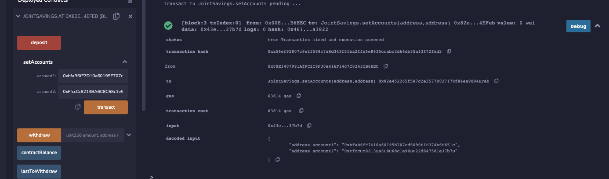
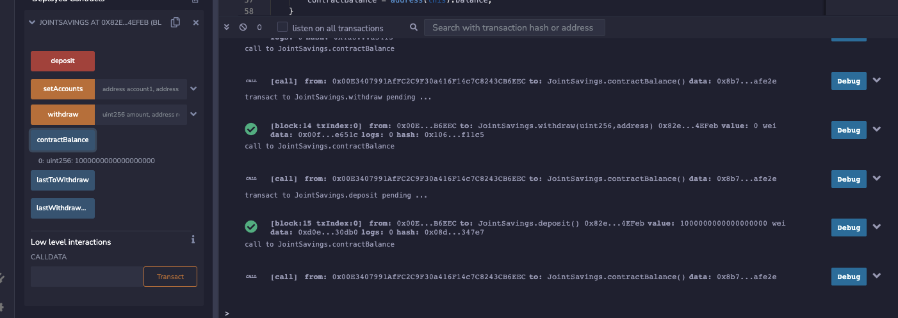
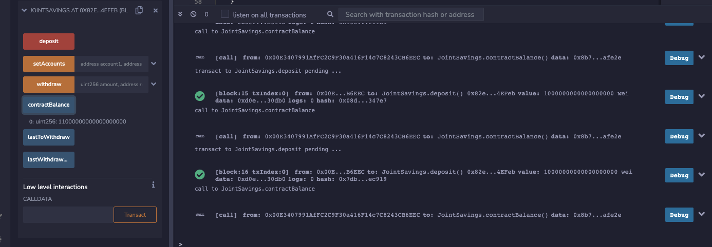
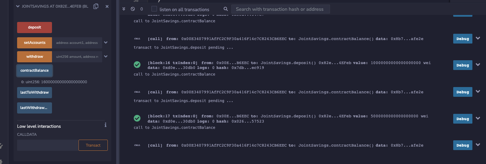
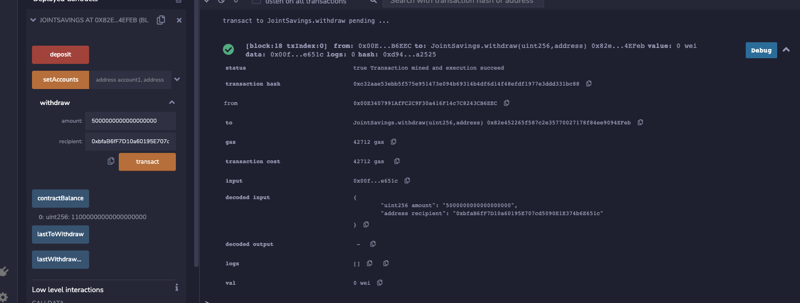
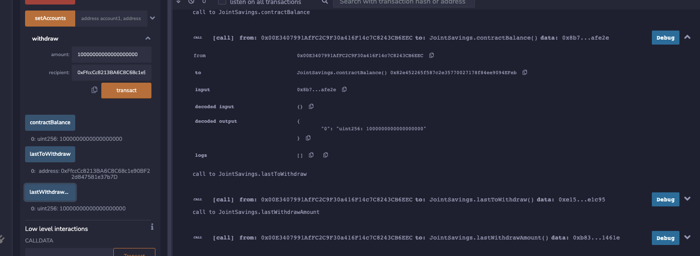
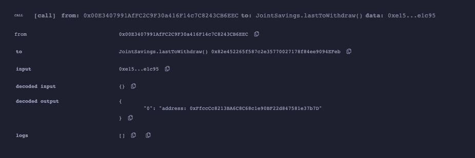
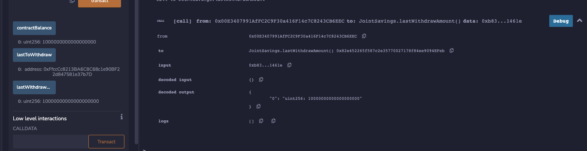

# Execution Results
Screenshots demonstrating functionality of the smart contract.

**setAccounts**
  

**deposit 1**
  

**deposit 10**
  

**deposit 5**
  

**withdraw 5**
  

**withdraw 10**
  

**lastToWithdraw**
  

**lastWithdrawAmount**
  
